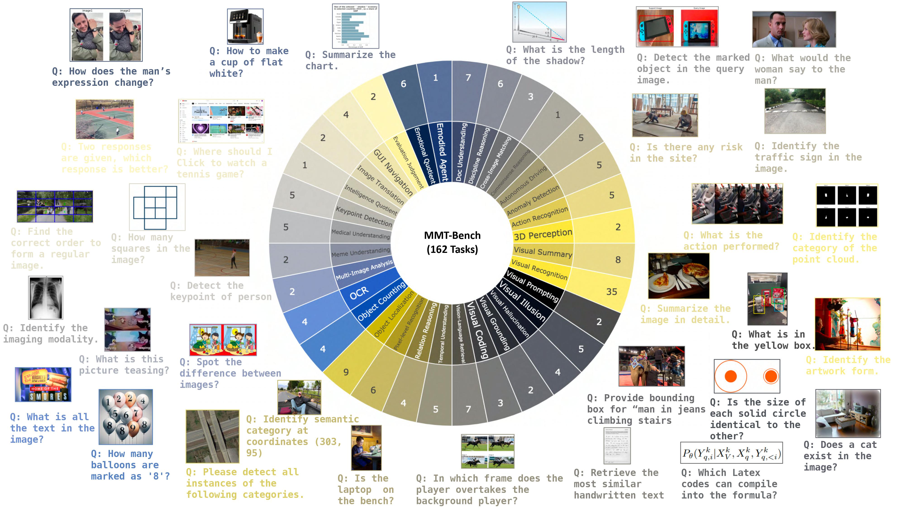

# MMT-Bench

<p align="left">
  <a href="#🚀-quick-start"><b>Quick Start</b></a> |
  <a href="https://mmt-bench.github.io/"><b>HomePage</b></a> |
  <a href="https://arxiv.org/abs/2404.16006"><b>arXiv</b></a> |
  <a href="https://huggingface.co/datasets/Kaining/MMT-Bench"><b>Dataset</b></a> |
  <a href="#🖊️-citation"><b>Citation</b></a> <br>

</p>


This repository is the official implementation of [MMT-Bench](https://arxiv.org/abs/2404.16006). 

> [MMT-Bench: A Multimodal MultiTask Benchmark for Comprehensive Evaluation of Large Vision-Language Models](https://arxiv.org/abs/2404.16006)  
> Kaining Ying<sup>\*</sup>, Fanqing Meng<sup>\*</sup>, Jin Wang<sup>\*</sup>, Zhiqian Li, Han Lin, Yue Yang, Hao Zhang, Wenbo Zhang, Yuqi Lin, Shuo Liu, jiayi lei, Quanfeng Lu, Peng Gao, Runjian Chen, Peng Xu, Renrui Zhang, Haozhe Zhang, Yali Wang, Yu Qiao, Ping Luo, Kaipeng Zhang<sup>\#</sup>, Wenqi Shao<sup>\#</sup>  
> <sup>\*</sup> KY, FM and JW contribute equally.  
> <sup>\#</sup> WS (shaowenqi@pjlab.org.cn) and KZ (zhangkaipeng@pjlab.org.cn) are correponding authors. 



## 🏆 Leaderboard

### Full Set

| Rank | Model                 | Overall |
|------|-----------------------|---------|
| 1    | InternVL-Chat-v1.2    | 63.4    |
| 2    | Qwen-VL-Plus          | 62.3    |
| 3    | GPT-4V                | 62.0    |
| 4    | GeminiProVision       | 61.6    |
| 5    | LLaVA-NEXT-34B        | 60.8    |
| 6    | XComposer2            | 55.7    |
| 7    | BLIP2                 | 54.8    |
| 8    | Yi-VL-34B             | 54.2    |
| 9    | Monkey-Chat           | 53.4    |
| 10   | DeepSeek-VL-7B        | 53.2    |
| 11   | Yi-VL-6B              | 53.2    |
| 12   | LLaVA-NEXT-13B        | 53.0    |
| 13   | TransCore-M           | 52.7    |
| 14   | QWen-VL-Chat          | 52.5    |
| 15   | Claude3V-Haiku        | 52.2    |
| 16   | XComposer             | 52.1    |
| 17   | mPLUG-Owl2            | 52.0    |
| 18   | RBDash-v1-13B         | 51.8    |
| 19   | LLaVA-v1.5-13B        | 51.7    |
| 20   | CogVLM-Chat           | 51.6    |
| 21   | ShareGPT4V-7B         | 51.5    |
| 22   | LLaVA-NEXT-7B         | 51.1    |
| 23   | LLaVA-v1.5-13B-XTuner | 51.1    |
| 24   | LLaVA-InternLM2-7B    | 50.8    |
| 25   | LLaVA-v1.5-7B-XTuner  | 50.2    |
| 26   | SharedCaptioner       | 49.9    |
| 27   | LLaVA-InternLM-7B     | 49.7    |
| 28   | LLaVA-v1.5-7B         | 49.5    |
| 29   | LLaMA-Adapter-v2-7B   | 40.4    |
| 30   | VisualGLM-6B          | 38.6    |
| 31   | Frequency Guess       | 31.7    |
| 32   | Random Guess          | 28.5    |

### VAL Split

Coming soon.

### TEST Split

Coming soon.


## 💡 News

- `2024/04/24`: The technical report of [MMT-Bench](https://arxiv.org/abs/2404.16006) is released! And check our [project page](https://mmt-bench.github.io/)!
- `2024/04/26`: We release the evaluation code and the `VAL` split.


## 🚀 Quick Start

Please refer to [this](Quickstart.md) to quick start.


## 💐 Acknowledgement

We expressed sincerely gratitude for the projects listed following:
- [VLMEvalKit](https://github.com/open-compass/VLMEvalKit) provides useful out-of-box tools and implements many adavanced LVLMs. Thanks for their selfless dedication.


## 🖊️ Citation 
If you feel MMT-Bench useful in your project or research, please kindly use the following BibTeX entry to cite our paper. Thanks!
```
@misc{mmtbench,
    title={MMT-Bench: A Comprehensive Multimodal Benchmark for Evaluating Large Vision-Language Models Towards Multitask AGI}, 
    author={Kaining Ying and Fanqing Meng and Jin Wang and Zhiqian Li and Han Lin and Yue Yang and Hao Zhang and Wenbo Zhang and Yuqi Lin and Shuo Liu and Jiayi Lei and Quanfeng Lu and Runjian Chen and Peng Xu and Renrui Zhang and Haozhe Zhang and Peng Gao and Yali Wang and Yu Qiao and Ping Luo and Kaipeng Zhang and Wenqi Shao},
    year={2024},
    eprint={2404.16006},
    archivePrefix={arXiv},
    primaryClass={cs.CV}
}
```