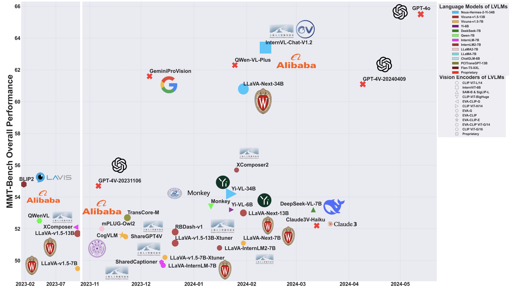

# Best Practice

Opencompass [VLMEevalKit](https://github.com/open-compass/VLMEvalKit) supports MMT-Bench now! **We strongly recommend using [VLMEevalKit](https://github.com/open-compass/VLMEvalKit) for its useful features and ready-to-use LVLM implementations**.

# MMT-Bench

<p align="left">
  <a href="#🚀-quick-start"><b>Quick Start</b></a> |
  <a href="https://mmt-bench.github.io/"><b>HomePage</b></a> |
  <a href="https://arxiv.org/abs/2404.16006"><b>arXiv</b></a> |
  <a href="https://huggingface.co/datasets/OpenGVLab/MMT-Bench"><b>Dataset</b></a> |
  <a href="#🖊️-citation"><b>Citation</b></a> <br>
</p>

This repository is the official implementation of [MMT-Bench](https://arxiv.org/abs/2404.16006). 

> [MMT-Bench: A Multimodal MultiTask Benchmark for Comprehensive Evaluation of Large Vision-Language Models](https://arxiv.org/abs/2404.16006)  
> Kaining Ying<sup>\*</sup>, Fanqing Meng<sup>\*</sup>, Jin Wang<sup>\*</sup>, Zhiqian Li, Han Lin, Yue Yang, Hao Zhang, Wenbo Zhang, Yuqi Lin, Shuo Liu, jiayi lei, Quanfeng Lu, Peng Gao, Runjian Chen, Peng Xu, Renrui Zhang, Haozhe Zhang, Yali Wang, Yu Qiao, Ping Luo, Kaipeng Zhang<sup>\#</sup>, Wenqi Shao<sup>\#</sup>  
> <sup>\*</sup> KY, FM and JW contribute equally.  
> <sup>\#</sup> WS (shaowenqi@pjlab.org.cn) and KZ (zhangkaipeng@pjlab.org.cn) are correponding authors. 

## 💡 News

- `2024/04/24`: The technical report of [MMT-Bench](https://arxiv.org/abs/2404.16006) is released! And check our [project page](https://mmt-bench.github.io/)!
- `2024/04/26`: We release the evaluation code and the `VAL` split.
- `2024/05/01`: MMT-Bench is accepted by ICML 2024. See you in Vienna! 🇦🇹🇦🇹🇦🇹
- `2024/06/17`: Opencompass [VLMEevalKit](https://github.com/open-compass/VLMEvalKit) supports MMT-Bench now! **We strongly recommend using [VLMEevalKit](https://github.com/open-compass/VLMEvalKit) for its useful features and ready-to-use LVLM implementations**.
- `2024/06/25`: The evaluation of `ALL` split is host on the [EvalAI](https://eval.ai/web/challenges/challenge-page/2328/overview).
- `2024/06/25`: We release the `ALL` split and `VAL` split.

## Introduction
MMT-Bench is a comprehensive benchmark designed to assess LVLMs across massive multimodal tasks requiring expert knowledge and deliberate visual recognition, localization, reasoning, and planning. MMT-Bench comprises 31, 325 meticulously curated multi-choice visual questions from various multimodal scenarios such as vehicle driving and embodied navigation, covering 32 core meta-tasks and 162 subtasks in multimodal understanding.


## Evaluation Results Overview
- The closed-source proprietary model GPT-4o from OpenAI has taken a leading position in MMT-Bench, surpassing other models such as InternVL-chat, QWen-VL-Plus, GPT-4V, and GeminiProVision. Note that the open-source models InternVL-chat and QwenVL-Max closely follow GPT-4o.


- GPT-4o performs well in visual recognition and captioning and improves a lot in visual perception compared with GPT-4V (20231106 & 20240409).


## 🏆 Leaderboard

### Full Set

| Rank | Model                       | Score |
|------|-----------------------------|-------|
| 1    | GPT4o                       | 65.5  |
| 2    | InternVL-Chat-v1.2-34B      | 63.4  |
| 3    | QwenVLMax                   | 62.4  |
| 4    | Qwen-VL-Plus                | 62.3  |
| 5    | GeminiProVision             | 61.6  |
| 6    | GPT4V_20240409              | 61.1  |
| 7    | LLaVA-NEXT-34B              | 60.8  |
| 8    | XComposer2                  | 55.7  |
| 9    | BLIP2                       | 54.8  |
| 10   | GPT4V_20231106              | 54.7  |
| 11   | Yi-VL-34B                   | 54.2  |
| 12   | Monkey-Chat                 | 53.4  |
| 13   | DeepSeek-VL-7B              | 53.2  |
| 14   | Yi-VL-6B                    | 53.2  |
| 15   | LLaVA-NEXT-13B              | 53.0  |
| 16   | TransCore-M                 | 52.7  |
| 17   | QWen-VL-Chat                | 52.5  |
| 18   | Claude3V_Haiku              | 52.2  |
| 19   | XComposer                   | 52.1  |
| 20   | mPLUG-Owl2                  | 52.0  |
| 21   | RBDash-v1-13B               | 51.8  |
| 22   | LLaVA-v1.5-13B              | 51.7  |
| 23   | CogVLM-Chat                 | 51.6  |
| 24   | ShareGPT4V-7B               | 51.5  |
| 25   | LLaVA-NEXT-7B               | 51.1  |
| 26   | LLaVA-v1.5-13B-XTuner       | 51.1  |
| 27   | LLaVA-InternLM2-7B          | 50.8  |
| 28   | LLaVA-v1.5-7B-XTuner        | 50.2  |
| 29   | SharedCaptioner             | 49.9  |
| 30   | LLaVA-InternLM-7B           | 49.7  |
| 31   | LLaVA-v1.5-7B               | 49.5  |
| 32   | LLaMA-Adapter-v2-7B         | 40.4  |
| 33   | VisualGLM-6B                | 38.6  |
| 34   | Frequency Guess             | 31.7  |
| 35   | Random Guess                | 28.5  |


## 🚀 Quick Start

Please refer to [this](Quickstart.md) to quick start.


## 💐 Acknowledgement

We expressed sincerely gratitude for the projects listed following:
- [VLMEvalKit](https://github.com/open-compass/VLMEvalKit) provides useful out-of-box tools and implements many adavanced LVLMs. Thanks for their selfless dedication.


## 🖊️ Citation 
If you feel MMT-Bench useful in your project or research, please kindly use the following BibTeX entry to cite our paper. Thanks!
```
@misc{mmtbench,
    title={MMT-Bench: A Comprehensive Multimodal Benchmark for Evaluating Large Vision-Language Models Towards Multitask AGI}, 
    author={Kaining Ying and Fanqing Meng and Jin Wang and Zhiqian Li and Han Lin and Yue Yang and Hao Zhang and Wenbo Zhang and Yuqi Lin and Shuo Liu and Jiayi Lei and Quanfeng Lu and Runjian Chen and Peng Xu and Renrui Zhang and Haozhe Zhang and Peng Gao and Yali Wang and Yu Qiao and Ping Luo and Kaipeng Zhang and Wenqi Shao},
    year={2024},
    eprint={2404.16006},
    archivePrefix={arXiv},
    primaryClass={cs.CV}
}
```